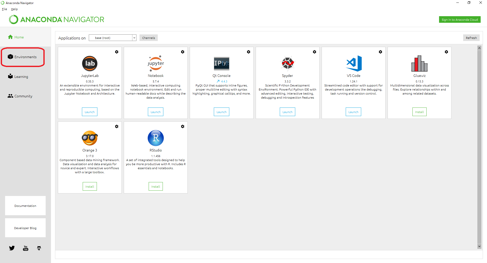
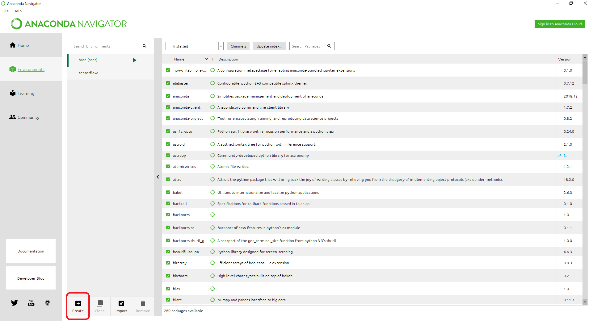
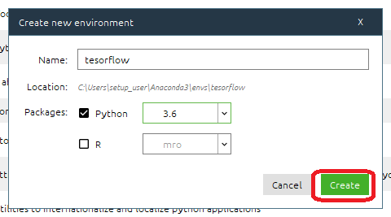
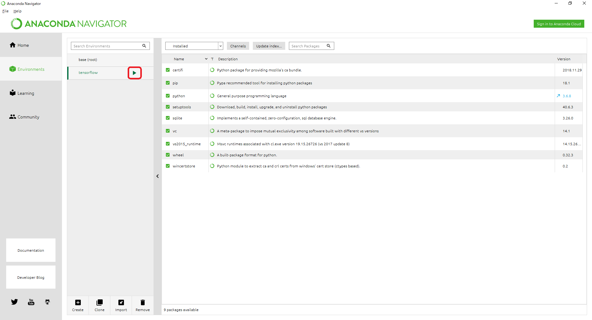

# ImageClassification
image-classification repogitry for practice

## 概要
 1. とりあえず画像を分類してみる
 2. 分類器を自分好みにする
 3. 自分好みの分類器を検証する

## ソースコード
　https://github.com/daring-board/image-classification

## 実行環境構築
　実行環境にはAnacondaPythonを使用する。  
  インストーラは下記に配置してある。ホームページよりダウンロードして実行してもよい。
  ```
  \\micsvr03\Order\Develop\micstarter\PROJ\05_企画道場\02.活動\勉強会\20190111_静止画機械学習
  Anaconda3-2018.12-Windows-x86_64.exe
  ```
  インストール後の手順は以下。
  1. Anaconda Navigatorを起動して、左サイドバーメニューからEnviromentsを選択。
  
  2. 展開された画面の環境選択セクションで、Createボタンをクリック。
  
  3. 環境名をimage-classificationなど好きな名前を付与して、PackageをPython 3.6にして、Create。
  
  4. 作成した環境名の[▼]ボタンを押下して、『Open Terminal』を選択。
  
  5. 下記のコマンドを実行する。

### 要件追加コマンド
　プログラムを実行するための依存モジュールのインストールコマンド。  
  - opencv
    ```
    pip install --ignore-installed --upgrade opencv-python
    ```
  - tensorflow
    ```
    pip install --ignore-installed --upgrade tensorflow
    ```
  - keras
    ```
    pip install --ignore-installed --upgrade keras
    ```

## プログラム実行方法
  0. ソースコードを取得する  
    - Gitコマンドが使える場合  
      git clone https://github.com/daring-board/image-classification.git  
    - 使えない場合  
    https://github.com/daring-board/image-classification よりZIPファイルをダウンロードして展開  

  1. とりあえず画像を分類してみる  
    1. 取得したプロジェクトフォルダ内のtmpフォルダに分類してみたい画像を配置する。  
    2. 下記のコマンドを実行する。    
    ```
    python pretrained.py    
    ```
    補足：分類できる画像の種類は下記を参照。  
    http://image-net.org/challenges/LSVRC/2012/browse-synsets

  2. 分類器を自分好みにする  
    1. 学習データを下記からダウンロードする。  
    ```
    \\micsvr03\Order\Develop\micstarter\PROJ\05_企画道場\02.活動\勉強会\20190111_静止画機械学習\dataset\10-monkey-full
    ```  
    2. ダウンロードデータを取得したプロジェクトフォルダに配置。  
    3. 下記コマンドでモデルを再学習する。  
    ```
    python finetuning.py
    ```

  3. 自分好みの分類器を検証する  
    1. 下記コマンドで再学習したモデルの精度を確認する。  
    ```
    python predict_finefuning.py
    ```
