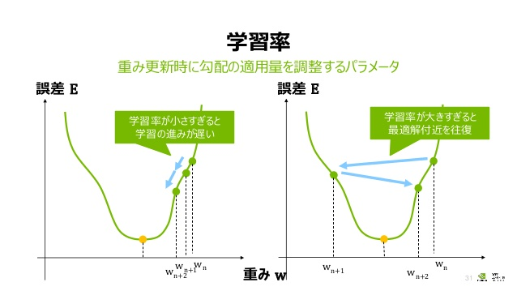

# 精度向上のために
データの量・質以外の要素により分類精度を向上させる手法を紹介する。
 1. 学習回数の増加
 2. ドロップアウト率の変更
 3. 最適化手法の変更
 4. 学習モデルの選定
 5. 学習レイヤーの追加

## 学習回数の増加
学習回数を増やすためには、epochと呼ばれる値を変更すればよい。  

`finetuning.py`の`model.fit()`に変更対象のパラメータがある。  
このプロジェクトのデフォルト値10を変更
```
  '''
  モデルの学習
  '''
  model.fit(x, y, epochs=10)
```

epochを50に変更
```
  '''
  モデルの学習
  '''
  model.fit(x, y, epochs=50)
```

### epochとは
学習データを何回学習させるかのパラメータである。  
上の例では学習データを10回トレーニングさせていたのを50回まで増やす。
> "データセット全体に対する1回の処理単位"と一般的に定義されている，任意の区切りのこと．訓練のフェーズを明確に区切って，ロギングや周期的な評価するのに利用されます．

https://keras.io/ja/getting-started/faq/#samplebatchepoch  
epochを増やすことで学習データにより適合した学習モデルが構築できる。  
***lossやaccの値が変動しており、まだまだ改善されそうな場合に増やすことを推奨する。  
増やし過ぎると過学習という現象に陥る。***

### 過学習とは
過学習とは、学習データに適合しているがテストデータや予測データに適合していない状態を指す。  
本来は学習データの特徴を見分けて分類を行いたいのに、学習モデルが学習データ全体を暗記して  
しまうことによって、学習データ以外のデータで精度が上がらなくなる現象。  
https://kotobank.jp/word/%E9%81%8E%E5%AD%A6%E7%BF%92-1739118

## ドロップアウト率の変更
学習時にすでに学習した特徴を部分的に忘れさせることにより、学習モデルにより重要な特徴を  
抽出させようとする方法をドロップアウトという。  
このドロップアウトの割合を増やすことで、学習モデルのデータの暗記を防ぎ過学習を防止する。  
このプロジェクトのデフォルトはドロップアウト率25%。  
```
  '''
  転移学習用のレイヤーを追加
  '''
  added_layer = GlobalAveragePooling2D()(base_model.output)
  added_layer = Dense(512, activation='relu')(added_layer)
  added_layer = Dropout(0.25)(added_layer)
  added_layer = Dense(len(labels), activation='softmax', name='classification')(added_layer)
```

以下のようにドロップアウト率を50%まで増やすことで、epochを増やした場合の過学習を防止する。  
```
  '''
  転移学習用のレイヤーを追加
  '''
  added_layer = GlobalAveragePooling2D()(base_model.output)
  added_layer = Dense(512, activation='relu')(added_layer)
  added_layer = Dropout(0.5)(added_layer)
  added_layer = Dense(len(labels), activation='softmax', name='classification')(added_layer)
```
***学習データを学習させたときのaccの値とテストデータの精度の値がかけ離れている場合に  
過学習が発生している可能性があるので、ドロップアウトで対応することを推奨する。***

## 最適化手法の変更
最適化手法とは、学習モデルを学習させる際に『どのように学習を進めるか』を担う。  
このプロジェクトでは、『Adam』という手法を使用している。
```
  '''
  全体のモデルをコンパイル
  '''
  model.compile(optimizer='Adam', loss='categorical_crossentropy', metrics=['accuracy'])
```

これを『Rmsprop』に変更する。
```
  '''
  全体のモデルをコンパイル
  '''
  model.compile(optimizer='RMSprop', loss='categorical_crossentropy', metrics=['accuracy'])
```
『Adam』、『RMSprop』の他、『SGD』などが存在する。  
https://keras.io/ja/optimizers/

### SGD(確率的勾配降下法)
最適化手法の重要な概念に **学習率** があるが、『SGD』では学習率が固定になっている。  
また、『Adam』、『RMSprop』に比べて学習が遅くなる。**転移学習** において、極小さい学習率を  
設定して使用される場合がある。
### RMSprop
『RMSprop』は『SGD』よりも学習は早いが、『Adam』よりも学習が遅い。『RMSprop』は学習率を　　
自動調整してくれる。画像データに対する学習よりもテキストデータに対する学習でより効果を  
発揮するようである。
### Adam
『Adam』は、『SGD』と『RMSprop』を改善統合したような手法。学習率は自動調整され、現行最も  
学習が早い手法とされている。しかし、学習が早いがゆえに転移学習等では過学習に陥り気味になる  
ので、その調整のために『SGD』や『RMSprop』を利用することがある。

### 学習率(Learning Rate)
学習率とは、学習モデルが学習を進める際のステップサイズである。  
ステップサイズが大きすぎると、loss(誤差)の値が最小となる結果に落とし込むことができなくなる。  
その一方で、ステップサイズが小さすぎると学習が遅くなり、学習データのみに適合して過学習の状態に陥ることが多くなる。

https://www.slideshare.net/NVIDIAJapan/ss-75109746

### 転移学習(Finetuning)
学習済みの学習モデルを再学習して、別の用途に適合した学習モデルを構築すること。  
https://furien.jp/columns/344/#1  
※厳密には転移学習とFinetuningは異なる。

## 学習モデルの選定
これまでの精度向上方法で効果が出ない場合は、学習モデルの再選定を検討する。  
このプロジェクトではマシンスペックや時間の関係上、軽量で学習の早い学習モデルを選定している。  
https://keras.io/ja/applications/
```
  '''
  学習済みモデルのロード(base_model)
  '''
  base_model = MobileNetV2(weights='imagenet', include_top=False)
```

時間もある、マシンスペックも十分よい(**GPU・TPU** が使える)などの条件が揃っている場合は、
より重量で汎化性能の高い学習モデルを選択してもよい。  
以下では、学習モデルを『MobileNetV2』から『InceptionResNetV2』に変更している。
```
  '''
  学習済みモデルのロード(base_model)
  '''
  base_model = InceptionResNetV2(weights='imagenet', include_top=False)
```

### MobileNetV2
モバイルデバイスでも機械学習が実行できるように設計された軽量(17MB程度)な学習モデル。  
軽量で高速なため、動画の物体検出にも使用される場合がある。  
http://proc-cpuinfo.fixstars.com/2018/12/mobilenet-ssd-1/  
VGGやInceptionResNetV2に比べると汎化性能は高くないが、1000種類の画像を分類できるなど  
十分な性能は備えている。

## 学習レイヤーの追加
もっと学習モデルをチューニングして、精度向上を目指すならば学習レイヤーを追加することを推奨する。  
このプロジェクトのデフォルトでは、以下のようなレイヤーを追加している。
```
  ''''
  転移学習用のレイヤーを追加
  '''
  added_layer = GlobalAveragePooling2D()(base_model.output)
  added_layer = Dense(512, activation='relu')(added_layer)
  added_layer = Dropout(0.25)(added_layer)
  added_layer = Dense(len(labels), activation='softmax', name='classification')(added_layer)
```

例えば、上記を以下のように修正する。
```
  ''''
  転移学習用のレイヤーを追加
  '''
  added_layer = GlobalAveragePooling2D()(base_model.output)
  added_layer = Dense(1024, activation='relu')(added_layer)
  added_layer = Dropout(0.5)(added_layer)
  added_layer = Dense(512, activation='relu')(added_layer)
  added_layer = Dropout(0.25)(added_layer)
  added_layer = Dense(len(labels), activation='softmax', name='classification')(added_layer)
```
全結合レイヤーを増やし、そのユニット(ニューロン)の数を1024としている。その上で過学習が  
発生しないようにドロップアウトレイヤーを追加して、その率を50%にしておく。  

さらに、元のMobileNetV2のレイヤーも再学習させたい場合、以下のセクションを変更する。
```
  '''
  base_modelのモデルパラメタは学習させない。
  (added_layerのモデルパラメタだけを学習させる)
  '''
  for layer in base_model.layers:
       layer.trainable = False
```

変更後
```
  '''
  base_modelのモデルパラメタは学習させない。
  (added_layerのモデルパラメタだけを学習させる)
  '''
  for layer in base_model.layers[:-3]:
       layer.trainable = False
```
ここではベースとなる学習モデルのレイヤーの出力層から数えて3つ以降は学習可能にするという  
変更を施している。
